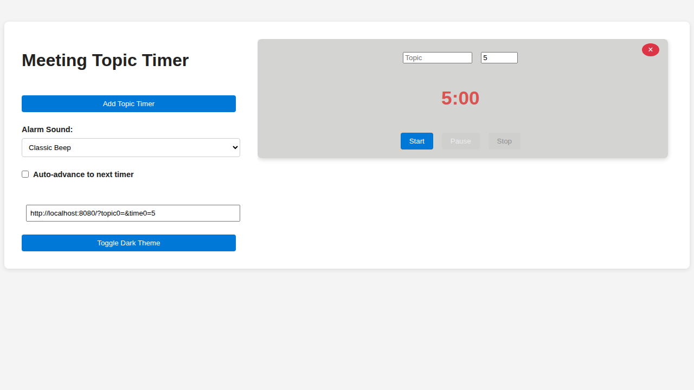
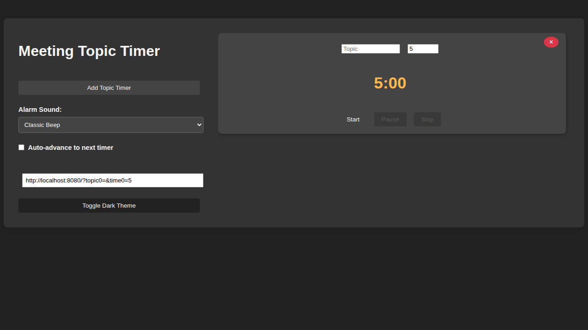

# Meeting Topic Timer

A modern, intuitive web application for managing multiple meeting timers. Perfect for time-boxed discussions, presentation segments, and keeping meetings on track.

🚀 **[Try it live at https://wdko.github.io/MeetingTimer/](https://wdko.github.io/MeetingTimer/)**

## Features

### Core Functionality
- **Multiple Timers**: Create and manage multiple topic timers simultaneously
- **Customizable Duration**: Set any duration in minutes for each timer
- **Real-time Countdown**: Visual countdown display with prominent timer formatting
- **Timer Controls**: Start, pause, resume, and stop individual timers
- **URL Sharing**: Generate shareable URLs that recreate your timer setup instantly

### Enhanced Experience
- **🌙 Dark Theme**: Toggle between light and dark themes, with automatic system preference detection
- **🔊 Alarm Sounds**: Choose from 5 different alarm sounds (Classic Beep, Digital Beep, Chimes, Soft Alert, Buzzer)
- **⏭️ Auto-Advance**: Automatically move to the next timer when one completes
- **📱 Responsive Design**: Works seamlessly on desktop, tablet, and mobile devices
- **💾 Persistent Settings**: Your alarm sound and auto-advance preferences are saved locally

## Screenshots

### Light Theme


### Dark Theme  


## Quick Start

### Using the Live Application
Simply visit **[https://wdko.github.io/MeetingTimer/](https://wdko.github.io/MeetingTimer/)** in your web browser - no installation required!

### Local Development Setup

1. **Clone the repository**
   ```bash
   git clone https://github.com/wdko/MeetingTimer.git
   cd MeetingTimer
   ```

2. **Start a local web server**
   
   Choose one of the following methods:
   
   **Python 3 (recommended)**
   ```bash
   python3 -m http.server 8080
   ```
   
   **Python 2**
   ```bash
   python -m http.server 8080
   ```
   
   **PHP**
   ```bash
   php -S localhost:8080
   ```
   
   **Node.js (if you have it installed)**
   ```bash
   npx serve . -p 8080
   ```

3. **Open in your browser**
   ```
   http://localhost:8080
   ```

### VS Code Users
If you're using VS Code, you can use the pre-configured task:
- Press `Ctrl+Shift+P` (or `Cmd+Shift+P` on Mac)
- Type "Tasks: Run Task"
- Select "Start Static Server"

## Usage Guide

### Creating Timers
1. Click "Add Topic Timer" to create a new timer
2. Enter a descriptive topic name in the text field
3. Set the duration using the number input (in minutes)
4. Repeat to add more timers as needed

### Managing Timers
- **Start**: Click "Start" to begin countdown
- **Pause**: Click "Pause" to temporarily stop (button changes to "Resume")
- **Stop**: Click "Stop" to reset timer to original duration
- **Remove**: Click the "×" button to delete a timer

### Sharing Timer Configurations
1. Set up your timers with topics and durations
2. Copy the URL from the "Share URL" input field
3. Share the URL with others - they'll see the same timer setup when they visit the link

### Customizing Your Experience
- **Theme**: Click "Toggle Dark Theme" to switch between light and dark modes
- **Alarm Sound**: Select your preferred completion sound from the dropdown
- **Auto-Advance**: Check the box to automatically move to the next timer when one completes

## Technical Details

### Technology Stack
- **Frontend**: Pure HTML5, CSS3, and vanilla JavaScript
- **Hosting**: GitHub Pages (static hosting)
- **No Build Process**: Direct deployment of source files
- **No Dependencies**: Zero external libraries or frameworks

### Browser Compatibility
- Modern browsers supporting ES6+ features
- Chrome, Firefox, Safari, Edge (recent versions)
- Mobile browsers on iOS and Android

### Project Structure
```
MeetingTimer/
├── index.html          # Main application HTML
├── app.js             # Application logic and timer management
├── style.css          # Styling and responsive design
├── Requirements.txt   # Project specifications
├── .vscode/
│   └── tasks.json     # VS Code server configuration
└── README.md          # This file
```

### Key Features Implementation
- **Timer Management**: JavaScript intervals with state management
- **URL Sharing**: URLSearchParams for encoding/decoding timer configurations
- **Theme System**: CSS classes with localStorage persistence
- **Audio System**: Web Audio API for customizable alarm sounds
- **Responsive Design**: CSS Flexbox with mobile-first approach

## Development

### Local Development
This is a static web application with no build process. Simply edit the HTML, CSS, or JavaScript files and refresh your browser to see changes.

### Making Changes
1. Start the local server (see Quick Start section)
2. Edit files directly:
   - `index.html` for structure changes
   - `app.js` for functionality changes  
   - `style.css` for styling changes
3. Refresh browser to see changes immediately
4. Test across different browsers and devices

### Contributing
1. Fork the repository
2. Create a feature branch
3. Make your changes
4. Test thoroughly across different browsers
5. Submit a pull request

## Features in Detail

### Timer States
Each timer maintains one of three states:
- **Stopped**: Initial state, can be started
- **Running**: Actively counting down  
- **Paused**: Temporarily stopped, can be resumed

### URL Sharing Format
Timer configurations are encoded in the URL using query parameters:
```
https://wdko.github.io/MeetingTimer/?topic0=Project%20Planning&time0=10&topic1=Code%20Review&time1=15
```

### Local Storage
The application saves these preferences locally:
- Selected alarm sound
- Auto-advance setting
- Theme preference (follows system preference by default)

## Audio Credits

Some alarm sounds in this application are provided by talented creators from [Freesound.org](https://freesound.org):

- **Wakey** by [SergeQuadrado](https://freesound.org/people/SergeQuadrado/) - [Source](https://freesound.org/people/SergeQuadrado/sounds/460662/)
- **Alarm Clock Digital** by [zanox](https://freesound.org/people/zanox/) - [Source](https://freesound.org/people/zanox/sounds/233645/)  
- **Alarm Clock Beep** by [SpliceSound](https://freesound.org/people/SpliceSound/) - [Source](https://freesound.org/people/SpliceSound/sounds/369879/)

All sounds are licensed under Creative Commons. Special thanks to the Freesound.org community for making high-quality audio resources freely available!

## License

This project is open source. See the repository for license details.

## Support

For issues, feature requests, or questions:
- Create an issue on [GitHub](https://github.com/wdko/MeetingTimer/issues)
- Visit the [live application](https://wdko.github.io/MeetingTimer/) to see it in action

---

**Made with ❤️ for better meeting management**